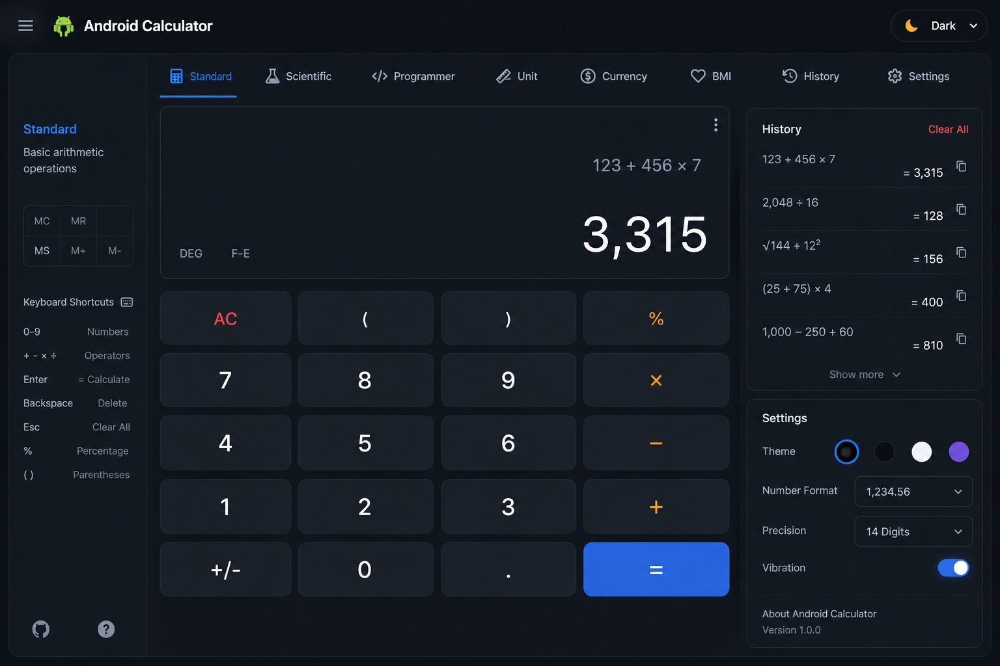
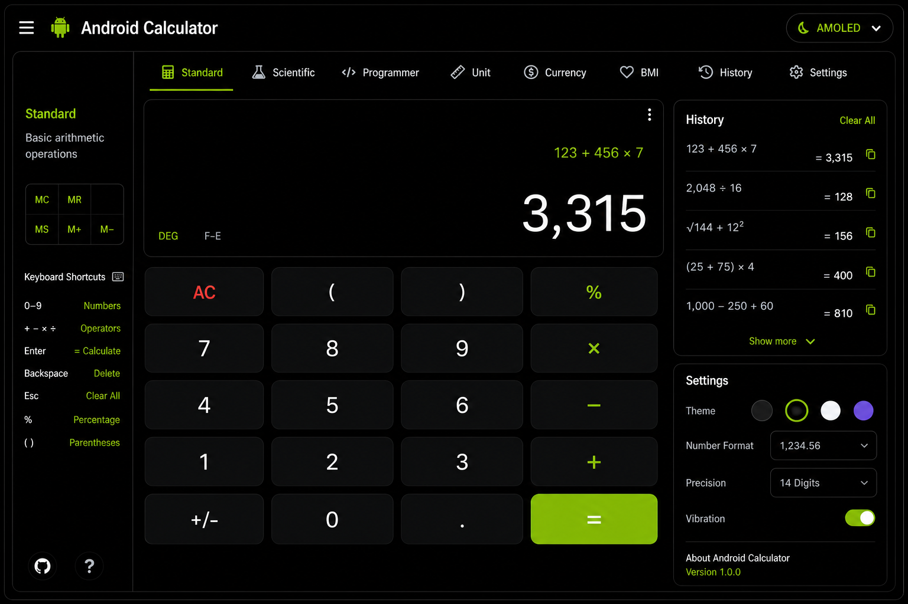
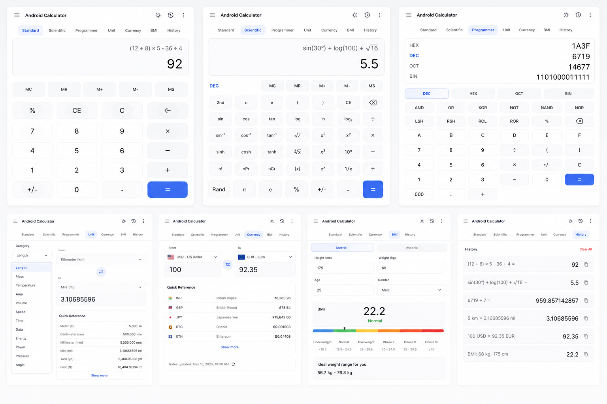
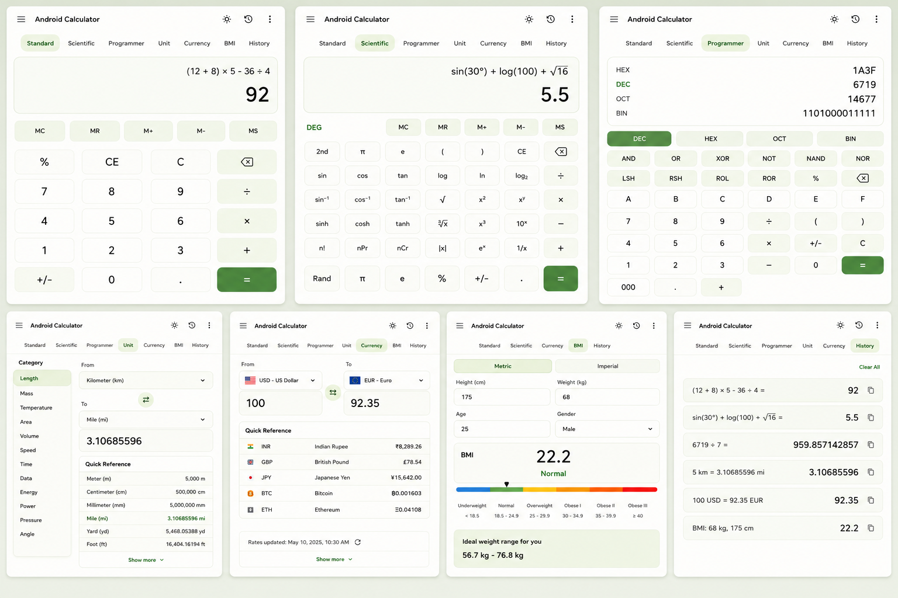

<div align="center">


# Android Calculator

### Advanced multi-mode calculator — engineered for daily use

[](LICENSE)
[](https://react.dev)
[](https://typescriptlang.org)
[](https://vitejs.dev)
[](CONTRIBUTING.md)

[**Live Demo →**](https://aranya2801.github.io/Android-Calculator) &nbsp;|&nbsp; [Report Bug](https://github.com/Aranya2801/Android-Calculator/issues) &nbsp;|&nbsp; [Request Feature](https://github.com/Aranya2801/Android-Calculator/issues)

</div>

---

## ✨ Overview

**Android Calculator** is a production-quality, feature-rich calculator application built with **React 18 + TypeScript + Vite**, engineered to the same standard you'd expect from a top-tier Android system app — but running entirely in your browser. Every detail is crafted for real, daily professional use.

> *"Build tools you actually want to use every day."*

---

## 🚀 Feature Matrix

| Feature | Standard | Scientific | Programmer | Unit | Currency | BMI | History |
|---------|----------|------------|------------|------|----------|-----|---------|
| Full arithmetic | ✅ | ✅ | ✅ | — | — | — | — |
| Memory (MC/MR/MS/M+/M−) | ❌ | ✅ | ❌ | — | — | — | — |
| Trigonometry (sin/cos/tan + inverses + hyp) | ❌ | ✅ | ❌ | — | — | — | — |
| Logarithms (log/ln/log₂) | ❌ | ✅ | ❌ | — | — | — | — |
| Powers, roots, factorial | ❌ | ✅ | ❌ | — | — | — | — |
| nPr / nCr combinatorics | ❌ | ✅ | ❌ | — | — | — | — |
| DEG / RAD / GRAD toggle | ❌ | ✅ | ❌ | — | — | — | — |
| Constants (π, e, φ) | ❌ | ✅ | ❌ | — | — | — | — |
| Bitwise (AND/OR/XOR/NOT/NAND/NOR/LSH/RSH) | ❌ | ❌ | ✅ | — | — | — | — |
| Base conversion (DEC/HEX/OCT/BIN) | ❌ | ❌ | ✅ | — | — | — | — |
| 12 unit categories / 100+ units | ❌ | ❌ | ❌ | ✅ | — | — | — |
| 50+ currencies including crypto | ❌ | ❌ | ❌ | — | ✅ | — | — |
| BMI (metric + imperial) + category bar | ❌ | ❌ | ❌ | — | — | ✅ | — |
| Persistent calculation history | ✅ | ✅ | ✅ | — | — | — | ✅ |
| 4 themes (Dark / AMOLED / Light / Material) | ✅ | ✅ | ✅ | ✅ | ✅ | ✅ | ✅ |
| Keyboard shortcut support | ✅ | ✅ | ✅ | — | — | — | — |
| LocalStorage persistence | ✅ | ✅ | ✅ | ✅ | ✅ | ✅ | ✅ |

---

## 📸 Screenshots

> *(Add screenshots of your app after build — place them in `assets/screenshots/`)*

| Dark Theme | AMOLED Theme | Light Theme | Material You |
|:---:|:---:|:---:|:---:|
|  |  |  |  |

---

## 🧮 Modes In Detail

### Standard Calculator
Full-precision arithmetic with percentage, sign toggle, and backspace. Clean, distraction-free layout.

### Scientific Calculator
- **Trigonometry** — sin, cos, tan with inverse (asin, acos, atan) and hyperbolic variants
- **Logarithms** — log₁₀, ln, log₂
- **Powers & roots** — x², x³, xʸ, √x, ∛x, ʸ√x
- **Combinatorics** — nPr, nCr, n! (handles up to 170!)
- **Constants** — π, e (Euler's), φ (golden ratio), Rand
- **Memory bank** — MC, MR, MS, M+, M−
- **Angle units** — DEG / RAD / GRAD toggle
- **2nd function shift** — reveals alternate operations on every key

### Programmer Calculator
- **Number bases** — Decimal, Hexadecimal, Octal, Binary — with live cross-base preview panel
- **Bitwise operations** — AND, OR, XOR, NOT, NAND, NOR, Left Shift, Right Shift
- **Context-aware key disabling** — BIN mode disables 2–9 and A–F keys automatically

### Unit Converter (12 categories, 100+ units)
| Category | Example Units |
|----------|--------------|
| Length   | km, m, cm, mm, μm, mi, yd, ft, in, nmi, ly, AU |
| Mass     | t, kg, g, mg, lb, oz, stone, short ton |
| Temperature | °C, °F, K, °R — with precise non-linear conversion |
| Area     | km², m², cm², ha, ac, mi², yd², ft², in² |
| Volume   | m³, L, mL, gal, qt, pt, cup, fl oz, ft³, in³ |
| Speed    | m/s, km/h, mph, knots, ft/s, Mach |
| Time     | yr, mo, wk, d, h, min, s, ms, μs, ns |
| Data     | bit, B, KB, MB, GB, TB, PB + KiB/MiB/GiB |
| Energy   | J, kJ, cal, kcal, Wh, kWh, BTU, eV |
| Power    | W, kW, MW, hp, BTU/h |
| Pressure | Pa, kPa, bar, atm, psi, mmHg, Torr |
| Angle    | °, rad, grad, arcmin, arcsec, revolution |

### Currency Converter
- **50+ world currencies** including INR, USD, EUR, GBP, JPY, CNY and more
- **Crypto** — BTC & ETH included
- Quick reference grid for instant 1-unit comparisons
- Swap button for instant direction reversal

### BMI Calculator
- Metric (cm/kg) and Imperial (ft+in/lbs) modes
- Visual sliding indicator bar
- Color-coded categories: Underweight → Normal → Overweight → Obese I/II/III
- Ideal weight range calculation
- Age & gender inputs

### History & Settings
- Last 100 calculations stored via `localStorage`
- One-tap recall to restore any past result
- Clear all history
- **4 themes**: Dark, AMOLED, Light, Material You

---

## ⌨️ Keyboard Shortcuts

| Key | Action |
|-----|--------|
| `0`–`9` | Digit input |
| `.` | Decimal point |
| `+` `-` `*` `/` | Operators |
| `Enter` or `=` | Evaluate |
| `Backspace` | Delete last digit |
| `Escape` | Clear all (AC) |
| `%` | Percent |
| `^` | Power |
| `(` `)` | Parentheses |

---

## 🏗️ Architecture & Tech Stack

```
Android-Calculator/
├── public/
│   └── favicon.svg
├── src/
│   ├── components/
│   │   ├── Display.tsx          # Smart display with size scaling
│   │   ├── CalcButton.tsx       # Reusable button with ripple
│   │   ├── StandardMode.tsx     # Standard 4×5 grid
│   │   ├── ScientificMode.tsx   # 5-column scientific layout
│   │   ├── ProgrammerMode.tsx   # Programmer with base preview
│   │   ├── UnitConverter.tsx    # Scrollable unit categories
│   │   ├── CurrencyConverter.tsx
│   │   ├── BMICalculator.tsx    # With animated BMI bar
│   │   └── HistoryPanel.tsx     # History + theme switcher
│   ├── hooks/
│   │   └── useCalculator.ts     # Central state machine
│   ├── utils/
│   │   ├── calculatorEngine.ts  # Math evaluation engine (mathjs)
│   │   ├── unitData.ts          # 100+ unit definitions
│   │   └── currencyData.ts      # 50+ currency rates
│   ├── types/
│   │   └── index.ts             # All TypeScript interfaces
│   ├── styles/
│   │   └── globals.css          # CSS custom-property design system
│   ├── App.tsx                  # Root component + keyboard handler
│   └── main.tsx                 # React DOM entry
├── index.html
├── vite.config.ts
├── tsconfig.json
├── tailwind.config.js
├── LICENSE
└── README.md
```

### Key Design Decisions

**Custom CSS Design System** — All theming is driven by CSS custom properties (`--bg-base`, `--text-primary`, etc.) set via `data-theme` attribute. Theme switches are instant with no re-renders.

**Math Engine** — Uses `mathjs` for safe expression evaluation, with a custom preprocessing layer that handles angle unit conversion, trig functions, and operator symbol normalization.

**State Machine** — A single `useCalculator` hook contains all calculator logic. The `handleButton` reducer pattern ensures predictable state transitions.

**Performance** — Pure CSS animations, no heavy animation libraries for core interactions. `framer-motion` is available for future page transitions.

---

## 🛠️ Installation & Development

### Prerequisites
- Node.js ≥ 18.0
- npm ≥ 9.0

### Quick Start

```bash
# Clone the repository
git clone https://github.com/Aranya2801/Android-Calculator.git
cd Android-Calculator

# Install dependencies
npm install

# Start development server
npm run dev
```

Open [http://localhost:5173/Android-Calculator/](http://localhost:5173/Android-Calculator/)

### Build for Production

```bash
npm run build
npm run preview
```

### Deploy to GitHub Pages

```bash
npm run build
# Push dist/ to gh-pages branch, or use GitHub Actions (see below)
```

### Available Scripts

| Script | Description |
|--------|-------------|
| `npm run dev` | Start dev server with HMR |
| `npm run build` | Production build (TypeScript check + Vite) |
| `npm run preview` | Preview production build locally |
| `npm run lint` | ESLint with strict rules |
| `npm run format` | Prettier format all source files |
| `npm run test` | Run unit tests with Vitest |

---

## 🔄 GitHub Actions — Auto Deploy

Create `.github/workflows/deploy.yml`:

```yaml
name: Deploy to GitHub Pages

on:
  push:
    branches: [main]

jobs:
  deploy:
    runs-on: ubuntu-latest
    steps:
      - uses: actions/checkout@v4
      - uses: actions/setup-node@v4
        with:
          node-version: '20'
          cache: 'npm'
      - run: npm ci
      - run: npm run build
      - uses: peaceiris/actions-gh-pages@v3
        with:
          github_token: ${{ secrets.GITHUB_TOKEN }}
          publish_dir: ./dist
```

---

## 🎨 Theming

The design system is built on CSS custom properties — add new themes by extending `globals.css`:

```css
[data-theme="my-theme"] {
  --bg-base:     #your-color;
  --bg-equals:   #your-accent;
  /* ... */
}
```

---

## 🧪 Testing

Unit tests for the calculator engine are in `src/utils/__tests__/`:

```bash
npm run test
```

Tests cover:
- Arithmetic precision
- Trig functions with DEG/RAD/GRAD conversions
- Factorial edge cases
- Base conversion accuracy
- Temperature conversion (non-linear)

---

## 📐 Mathematical Accuracy

- Floating-point results formatted to **12 significant digits** to avoid `0.1 + 0.2 = 0.30000000000000004` display issues
- Scientific notation kicks in for values `≥ 1×10¹⁵` or `< 1×10⁻¹⁰`
- Factorial supports up to **170!** (JavaScript's max safe factorial)
- Angle conversions maintain full double precision throughout

---

## 🗺️ Roadmap

- [ ] **Graphing mode** — plot functions with a canvas graph panel
- [ ] **Equation solver** — linear and quadratic
- [ ] **Matrix calculator** — 2×2 and 3×3 operations
- [ ] **Live currency rates** — fetch from open exchange rates API
- [ ] **PWA support** — installable as an app, offline capable
- [ ] **Widget mode** — floating mini-calculator overlay
- [ ] **Expression history editing** — tap any past expression to re-edit
- [ ] **Voice input** — Web Speech API integration
- [ ] **Export history** — CSV / PDF download

---

## 🤝 Contributing

Contributions are warmly welcome!

1. Fork the project
2. Create your feature branch (`git checkout -b feature/graphing-mode`)
3. Commit your changes (`git commit -m 'feat: add graphing mode'`)
4. Push to the branch (`git push origin feature/graphing-mode`)
5. Open a Pull Request

Please follow the [Conventional Commits](https://www.conventionalcommits.org/) spec.

---

## 📄 License

This project is licensed under the **MIT License** — see the [LICENSE](LICENSE) file for full details.

---

## 👤 Author

**Aranya Chakraborty**

- GitHub: [@Aranya2801](https://github.com/Aranya2801)

---

<div align="center">

Made with ❤️ and precision engineering

⭐ **Star this repo if it helps you!** ⭐

</div>
